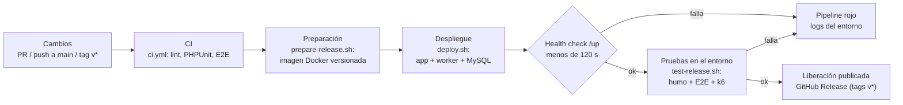

# Pipeline de liberación y despliegue continuo — BibliotecaOnline

> Issue: #156 · Fecha: 2026-09-28 · Autor: Javier Antonio Romo Bernal

Estados usados: **IMPLEMENTADO** (existe en el repositorio), **VALIDADO** (se ejecutó con el
resultado indicado), **PLANEADO** (propuesta).

---

## 1. Resumen



| Pieza | Archivo | Estado |
|---|---|---|
| Herramienta de liberación continua | GitHub Actions — `.github/workflows/release-deploy.yml` | **IMPLEMENTADO** |
| Script del pipeline (CI reutilizable) | `.github/workflows/ci.yml` (`workflow_call`) | **IMPLEMENTADO** |
| Generación/preparación del entorno | `scripts/prepare-release.sh`, `Dockerfile`, `docker/`, `docker-compose.release.yml` | **VALIDADO** (local) |
| Pruebas en el entorno | `scripts/test-release.sh` | **VALIDADO** (local) |
| Despliegue | `scripts/deploy.sh` | **VALIDADO** (local) |
| Rollback | `scripts/rollback.sh` | **VALIDADO** (local) |
| Ejecución en GitHub Actions | Run del PR de este issue | Ver §12 |

## 2. Justificación del pipeline

1. **GitHub Actions como herramienta de liberación continua.** El proyecto ya usa GitHub para
   issues, PRs y CI (`ci.yml`). Mantener todo en la misma plataforma evita otra cuenta u otro
   servidor (Jenkins, GitLab CI) y deja cada liberación enlazada a su commit, su PR y su run.
2. **El pipeline empieza con el CI existente.** `release-deploy.yml` llama a `ci.yml` con
   `workflow_call`: no se construye una liberación si fallan lint, PHPUnit o E2E. No se duplica la
   definición del CI.
3. **La liberación es una imagen Docker inmutable y versionada.** Contiene el código, las
   dependencias de producción (`composer --no-dev`) y los assets ya compilados. Lo que se prueba es
   exactamente lo que se despliega y lo que se publica.
4. **Contenedores como entorno de despliegue.** El issue permite un entorno local o controlado en
   contenedores. Docker Compose lo genera con scripts, igual en el runner de GitHub y en la máquina
   de cualquier integrante, con MySQL como motor (más parecido a un servidor real que SQLite).
5. **Se prueba lo desplegado, no el código fuente.** Después de desplegar se corren pruebas de humo,
   la suite E2E y k6 contra la URL del entorno. Así se detectan errores que solo aparecen en la
   imagen de producción (configuración cacheada, `APP_DEBUG=false`, assets, permisos, migraciones
   sobre MySQL).
6. **Scripts antes que YAML.** Cada etapa es un script de `scripts/` que se puede correr a mano; el
   workflow solo los orquesta. Si GitHub Actions no está disponible, el flujo se reproduce en local
   con los mismos comandos (§11).

## 3. Entorno de liberación y despliegue

| Servicio (`docker-compose.release.yml`) | Imagen | Función |
|---|---|---|
| `app` | `bibliotecaonline:<version>` (PHP 8.2 + Apache) | Sirve la aplicación en `http://127.0.0.1:8090`; al arrancar migra la BD y siembra datos si el catálogo está vacío |
| `worker` | `bibliotecaonline:<version>` | `php artisan queue:work`: procesa la cola (p. ej. activity logs, importación de Open Library) |
| `db` | `mysql:8.4` | Base de datos con volumen persistente `mysql_data` |

**Imagen de liberación (`Dockerfile`, 3 etapas):**

| Etapa | Base | Qué hace |
|---|---|---|
| `vendor` | `composer:2` | `composer install --no-dev` y autoload optimizado |
| `assets` | `node:20-alpine` | `npm ci` + `npm run build` (Vite + Tailwind) |
| final | `php:8.2-apache` | Extensiones `pdo_mysql` y `opcache`, DocumentRoot en `public/`, `HEALTHCHECK` a `/up`, `entrypoint` |

**Dónde corre el entorno:**

| Contexto | Host de Docker | Uso |
|---|---|---|
| GitHub Actions | Runner `ubuntu-latest` del job `deploy-verify` | Cada PR y cada liberación; el entorno se apaga al terminar el job |
| Local | Docker Desktop o Colima | Demostración y depuración; el entorno queda arriba hasta `docker compose down` |

No hay dominio público ni hosting externo: el issue no los exige (ver §13, Limitaciones).

## 4. Cómo se vincula la herramienta con el entorno

1. `build-release` construye la imagen con `scripts/prepare-release.sh` y la guarda como artefacto
   del run (`imagen-<version>`).
2. `deploy-verify` declara el **environment de GitHub `release-local`**: cada ejecución queda
   registrada en la pestaña *Deployments* del repositorio, con su commit y su resultado.
3. Ese job descarga la imagen (`docker load`), genera el entorno (`SKIP_BUILD=true
   scripts/prepare-release.sh`), despliega (`scripts/deploy.sh`) y verifica
   (`scripts/test-release.sh`) en el mismo runner.
4. En tags `v*`, `publish` crea un **GitHub Release** con la imagen (`.tar.gz`) y el reporte de
   verificación como notas.

## 5. Niveles de servicio

| # | Nivel de servicio | Origen | Cómo se verifica | Efecto si no se cumple |
|---|---|---|---|---|
| NS-1 | **p95 de `http_req_duration` < 5000 ms** | **Actividad (requisito del maestro)** | k6 en `test-release.sh` (thresholds de `jarbprueba.js` y `gaqprueba.js`) | El pipeline falla y no se publica |
| NS-2 | La aplicación responde `200` en `/up` en menos de **120 s** tras desplegar | Decisión del equipo | `deploy.sh` (`HEALTH_TIMEOUT`) | El despliegue falla |
| NS-3 | **0 fallos** en las pruebas de humo | Decisión del equipo | `test-release.sh` | El pipeline falla |
| NS-4 | **100 %** de la suite E2E pasa contra lo desplegado | Decisión del equipo | `test-release.sh` con `RUN_E2E=true` | El pipeline falla |
| NS-5 | Tasa de peticiones fallidas en k6 = **0 %** | Decisión del equipo | `checks: rate>0.99` / `http_req_failed` | El pipeline falla |

**Justificación de los niveles del equipo:** NS-2 da margen sobre el tiempo real de arranque (11 s
en local, incluido MySQL); NS-3 a NS-5 hacen que una liberación que rompe una página o un flujo nunca
se publique. Ninguno se presenta como requisito de la actividad.

## 6. Métricas de monitoreo

| Métrica | De dónde sale | Dónde se ve |
|---|---|---|
| Estado del pipeline por etapa (CI, construcción, despliegue, verificación, publicación) | GitHub Actions | Pestaña *Actions* y checks del PR |
| Historial de despliegues | Environment `release-local` · `.release/history` | Pestaña *Deployments* · resumen del run |
| Tiempo hasta `/up` tras desplegar | `deploy.sh` | `.release/history` y log del job |
| Estado HTTP y tiempo de respuesta por ruta (8 rutas) | `test-release.sh` (curl) | `dist/test-release/reporte.md`, resumen del run |
| Resultado de la suite E2E | Playwright | Reporte, artefacto `verificacion-<version>` |
| **p95**, promedio y máximo de respuesta | k6 (`http_req_duration`) | Reporte y `k6-*.json` |
| Tasa de errores | k6 (`http_req_failed`) y humo | Reporte |
| Salud del contenedor | `HEALTHCHECK` de la imagen (`/up` cada 10 s) | `docker compose ps` |
| Trabajos fallidos en la cola | Tabla `failed_jobs` | `php artisan queue:failed` dentro de `worker` |
| Logs de la aplicación | `LOG_CHANNEL=stderr` | `docker compose logs app worker` |

**PLANEADO:** con un entorno permanente, enviar estas métricas a un sistema de monitoreo (p. ej.
Prometheus + Grafana, o k6 Cloud) y alertar si `/up` falla o si el p95 se acerca al umbral.

## 7. Parámetros de configuración

### Variables de los scripts

| Variable | Default | Script | Descripción |
|---|---|---|---|
| `RELEASE_PORT` | `8090` | todos | Puerto del host donde se publica la app |
| `EXPORT` | `false` | `prepare-release.sh` | `true` exporta la imagen a `dist/bibliotecaonline-<version>.tar.gz` |
| `SKIP_BUILD` | `false` | `prepare-release.sh` | `true` solo genera `.env.release` (la imagen ya existe) |
| `HEALTH_TIMEOUT` | `120` | `deploy.sh` | Segundos máximos para que `/up` responda (NS-2) |
| `BASE_URL` | `http://127.0.0.1:$RELEASE_PORT` | `test-release.sh` | URL del entorno a verificar |
| `RUN_E2E` | `false` | `test-release.sh` | `true` ejecuta Playwright contra el entorno |
| `RUN_K6` | `false` | `test-release.sh` | `true` ejecuta k6 (10 VUs, 40 s) contra el entorno |

### Variables del contenedor

| Variable | Valor | Descripción |
|---|---|---|
| `RUN_MIGRATIONS` | `true` en `app`, `false` en `worker` | Solo un servicio migra, para evitar carreras |
| `SEED_ON_FIRST_DEPLOY` | `true` | Siembra si la tabla `libros` está vacía |
| `SEED_CLASSES` | `BibliotecaSeeder RolesSeeder` | Seeders de producción. `DatabaseSeeder` no se usa porque requiere Faker (dependencia de desarrollo) |

### `.env.release` (generado por `prepare-release.sh`, nunca versionado)

| Clave | Valor |
|---|---|
| `APP_ENV` / `APP_DEBUG` | `production` / `false` |
| `APP_KEY`, `DB_PASSWORD`, `MYSQL_ROOT_PASSWORD` | Aleatorios (`openssl rand`), generados una sola vez |
| `DB_CONNECTION` / `DB_HOST` / `DB_DATABASE` / `DB_USERNAME` | `mysql` / `db` / `biblioteca` / `biblioteca` |
| `SESSION_DRIVER`, `QUEUE_CONNECTION`, `CACHE_STORE` | `database` |
| `LOG_CHANNEL` / `MAIL_MAILER` | `stderr` / `log` |

### Imagen y workflow

| Parámetro | Valor | Dónde |
|---|---|---|
| PHP / servidor | 8.2 + Apache, `opcache.validate_timestamps=0` | `Dockerfile`, `docker/php.ini` |
| Health check | `/up` cada 10 s, 12 reintentos, 30 s de gracia | `Dockerfile` |
| Versión | tag `vX.Y.Z`, o `git describe` + número de run | `release-deploy.yml` |
| Disparadores | PR a `main`/`develop`, push a `main`, tags `v*`, manual | `release-deploy.yml` |
| Concurrencia | Un run por ref; el nuevo cancela al anterior | `release-deploy.yml` |
| Retención | Imagen 7 días, reportes 14 días | `release-deploy.yml` |
| Permisos | `contents: read`; `contents: write` solo en `publish` | `release-deploy.yml` |

## 8. Descripción de los scripts

| Script | Entrada | Qué hace | Salida |
|---|---|---|---|
| `scripts/prepare-release.sh [version]` | Versión (default `git describe`) | Genera `.env.release` si no existe; construye `bibliotecaonline:<version>`; opcionalmente la exporta | Imagen Docker; `dist/*.tar.gz` con `EXPORT=true` |
| `scripts/deploy.sh <version>` | Versión existente | `docker compose up`, espera `/up`, registra versión actual y anterior | Entorno arriba; `.release/current`, `.release/previous`, `.release/history` |
| `scripts/test-release.sh` | `RUN_E2E`, `RUN_K6`, `BASE_URL` | 8 pruebas de humo con tiempos; Playwright y k6 opcionales | `dist/test-release/reporte.md`, `k6-*.json`, `e2e.log`; código de salida = número de fallos |
| `scripts/rollback.sh [version]` | Versión (default `.release/previous`) | Vuelve a desplegar la versión anterior con `deploy.sh` | Entorno en la versión anterior |
| `docker/entrypoint.sh` | Variables del contenedor | Espera MySQL, migra, siembra si hace falta, `storage:link`, cachea config/rutas/vistas | Arranca Apache o el worker |

## 9. Manejo de secretos

- El pipeline **no necesita secretos de GitHub**: el entorno es efímero y sus credenciales se
  generan al vuelo en cada run.
- En local, `.env.release` se crea con permisos `600` y está en `.gitignore`, igual que `dist/` y
  `.release/`. `.dockerignore` excluye cualquier `.env` salvo `.env.example`, así que ninguna
  credencial entra a la imagen: se inyectan al arrancar con `env_file`.
- `APP_KEY` se conserva entre liberaciones (no se regenera si `.env.release` existe) para no
  invalidar sesiones ni datos cifrados.
- **Si el entorno pasara a un servidor permanente (PLANEADO):** las credenciales irían como secrets
  del environment de GitHub (solo los puede crear la dueña del repositorio) o en el servidor, nunca
  en el repositorio.

## 10. Rollback

1. `scripts/rollback.sh` vuelve a desplegar la versión registrada en `.release/previous` (la imagen
   sigue en Docker).
2. Las migraciones **no se revierten** automáticamente. Si la versión fallida cambió el esquema:
   `docker compose ... exec app php artisan migrate:rollback --step=N` o restaurar un respaldo.
3. En GitHub Actions no hace falta rollback: si una verificación falla, la liberación no se publica
   y el entorno se destruye al terminar el job.

## 11. Cómo ejecutar el flujo

### En local (Docker Desktop o Colima)

```bash
scripts/prepare-release.sh v-local                   # 1. entorno + imagen
scripts/deploy.sh v-local                            # 2. despliegue (http://127.0.0.1:8090)
RUN_E2E=true RUN_K6=true scripts/test-release.sh     # 3. pruebas sobre lo desplegado
scripts/rollback.sh                                  # (opcional) volver a la versión anterior

# Apagar (down -v borra también la base de datos del entorno)
RELEASE_VERSION=v-local docker compose --env-file .env.release -f docker-compose.release.yml down -v
```

Requisitos para `RUN_E2E`: `npm ci` y `npx playwright install chromium`. Para `RUN_K6`: k6
instalado.

### En GitHub Actions

| Evento | Qué corre |
|---|---|
| PR a `develop` o `main` | CI → construir → desplegar y verificar |
| Push a `main` | Igual que el PR |
| Tag `vX.Y.Z` (`git tag v3.0.0 && git push origin v3.0.0`) | Todo lo anterior + **GitHub Release** con la imagen |
| Manual | *Actions → Liberación y despliegue → Run workflow* (el workflow debe existir en la rama por defecto) |

### k6 dentro del pipeline

k6 **sí se integra** (la actividad lo deja como opcional). Se ejecuta en `deploy-verify`, después
del despliegue y de las pruebas E2E, con los mismos scripts de los integrantes (`jarbprueba.js` y
`gaqprueba.js`) apuntando al entorno desplegado. Usa un perfil reducido (`--stage 10s:10,20s:10,10s:0`,
10 VUs durante 40 s) para no alargar el pipeline, y conserva el threshold `p(95)<5000`. Las
corridas completas de 2 minutos de cada integrante siguen como evidencia independiente en
`tests/load/resultados/`.

## 12. Evidencia

### Ejecución local — VALIDADO (2026-09-28)

Máquina: macOS 26.6.1, Apple M4, 16 GB · Colima 0.10.3 (2 CPU, 4 GB) · Docker 29.8 · Compose 5.5.

| Paso | Resultado |
|---|---|
| `prepare-release.sh local-1` | Imagen construida en 93 s (incluye descarga de imágenes base); 781 MB |
| Primer `deploy.sh` | **Falló**: `DatabaseSeeder` usa Faker, que no está en la imagen de producción. Se corrigió sembrando solo `BibliotecaSeeder` y `RolesSeeder` cuando el catálogo está vacío |
| `deploy.sh local-2` (BD nueva) | `/up` sano en **11 s** (NS-2 ✓) |
| `test-release.sh` humo | **8/8 OK** (7–68 ms por ruta) (NS-3 ✓) |
| `test-release.sh` E2E | **12/12** en 5.5 s (NS-4 ✓) |
| `test-release.sh` k6 | `jarbprueba` p95 = **39.95 ms**, `gaqprueba` p95 = **66.98 ms**, 0 % fallidas (NS-1 ✓, NS-5 ✓) |
| Worker de colas | 9 027 activity logs procesados, 0 en `failed_jobs` |
| `deploy.sh local-3` + `rollback.sh` | Regresó a `local-2` en 18 s; `.release/history` registró los 3 despliegues |

### Ejecución en GitHub Actions — VALIDADO (2026-09-28)

Run [36373939156](https://github.com/Guadalupe-16/BibliotecaOnline/actions/runs/36373939156) del
PR #163 (commit `f8e3294`), versión de la liberación `v2.0.0-91-g7105c19-run1`:

| Job | Resultado | Duración |
|---|---|---|
| CI / ESLint + Prettier | ✅ | 17 s |
| CI / PHPUnit Tests | ✅ | 20 s |
| CI / E2E Playwright | ✅ | 1 min 1 s |
| Construir liberación | ✅ | 1 min 40 s |
| Desplegar y verificar (humo + E2E + k6) | ✅ | 3 min 16 s |
| Publicar liberación | Omitido (correcto: solo corre con tags `v*`) | — |

- Artefactos del run: `imagen-v2.0.0-91-g7105c19-run1` (la liberación), `verificacion-...` (reporte
  de humo, E2E y k6) y `playwright-report`.
- El environment `release-local` registró el despliegue del commit `f8e3294` en la pestaña
  *Deployments* del repositorio.
- El detalle de tiempos, p95 de k6 y resultados de humo está en el resumen del run (*Summary*).
- En el mismo commit, el job `PHPUnit Tests` del workflow independiente `CI — BibliotecaOnline`
  (run 36373938962) falló una vez con código de salida 2, mientras el mismo job dentro de este
  pipeline pasó. Al re-ejecutarlo pasó sin cambios de código, y la suite pasó 8 de 8 veces en local:
  se registra como fallo transitorio del runner, no de las pruebas.

## 13. Limitaciones

- **Entorno efímero en CI:** el despliegue en GitHub Actions vive lo que dura el job. Demuestra que
  la liberación se despliega y funciona, pero no queda un servidor accesible después.
- **Sin dominio público:** la app solo es accesible en la máquina donde corre el entorno.
- **Métricas puntuales:** se miden en cada liberación, no de forma continua (ver §6, PLANEADO).
- **Imagen de 781 MB:** la base `php:8.2-apache` es pesada; una base Alpine con PHP-FPM la reduciría
  (PLANEADO).
- **CI duplicado en PRs:** en un PR corren `CI — BibliotecaOnline` y el CI dentro de este pipeline.
  Se acepta para que el pipeline sea autocontenido.
