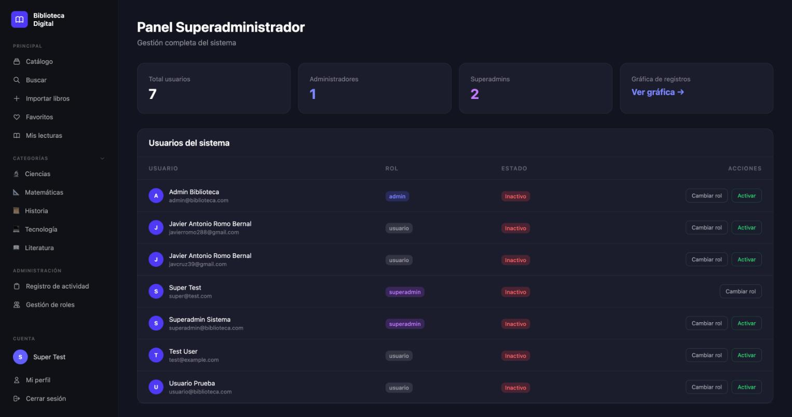
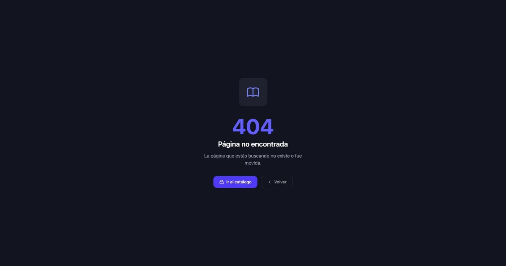

# Evidencia — Issue #116

**fix: eliminar ruta de acceso directo `/login-super` sin autenticación**
Severidad: **Alta** · Tipo: **Seguridad**

La evidencia demuestra **comportamiento**, no código: primero se provoca el fallo,
después se comprueba que quedó mitigado ejecutando **exactamente los mismos pasos**
en el **mismo entorno local** (`APP_ENV=local`, `http://127.0.0.1:8001`).

---

## El fallo

En `routes/web.php` existía una ruta temporal que iniciaba sesión como el usuario
`super@test.com` sin pedir credenciales y redirigía al panel de superadministrador.
Cualquier persona con el enlace obtenía control total del panel.

---

## ANTES — se provoca el fallo

### 1. El panel está protegido (punto de partida)

Sin sesión, `/superadmin` redirige al formulario de login. Todo parece correcto.


### 2. Se entra al panel SIN usuario ni contraseña

Basta con visitar `/login-super`. No se escribió ningún correo ni contraseña:
la sesión queda abierta como **Super Test** con **control total** — listado de los
7 usuarios reales del sistema y botones para **cambiar rol** y **activar/desactivar**.



### 3. Lo mismo a nivel HTTP (sesión limpia, sin navegador)

```
PASO 1 - Panel de superadmin SIN sesion:
  GET /superadmin  -> HTTP 302   Location: http://127.0.0.1:8001/login

PASO 2 - Ruta temporal, SIN enviar usuario ni contrasena:
  GET /login-super -> HTTP 302   Location: http://127.0.0.1:8001/superadmin   <-- regala la sesion

PASO 3 - Panel con la sesion que regalo el paso 2:
  GET /superadmin  -> HTTP 200
  <title>Panel Superadmin - Biblioteca Digital</title>
```

### 4. La prueba automatizada detecta el fallo (en rojo)

```
FAILED  RutaLoginSuperTest > la ruta login super ya no esta registrada
FAILED  RutaLoginSuperTest > la ruta login super responde no encontrado
FAILED  RutaLoginSuperTest > la ruta login super no inicia sesion como superadmin
        The user is authenticated
        Failed asserting that true is false.

Tests:  3 failed, 2 passed
```

`The user is authenticated` sin haber enviado credenciales: ese es el agujero.

---

## DESPUÉS — el fallo queda mitigado

La ruta se eliminó por completo de `routes/web.php`.

### 1. La ruta ya no existe

Mismo entorno local, misma URL: **404**.



### 2. El panel sigue protegido y ya no hay atajo

`/superadmin` sigue mandando al login, y ahora esa es la **única** entrada.


### 3. Lo mismo a nivel HTTP — mismos pasos que en el "antes"

```
PASO 1 - Panel de superadmin SIN sesion:
  GET /superadmin  -> HTTP 302   Location: http://127.0.0.1:8001/login

PASO 2 - Ruta temporal, SIN enviar usuario ni contrasena:
  GET /login-super -> HTTP 404                                   <-- ya no existe

PASO 3 - Panel despues de intentar el atajo:
  GET /superadmin  -> HTTP 302   Location: http://127.0.0.1:8001/login
```

### 4. Las mismas pruebas, ahora en verde

```
PASS  Tests\Feature\RutaLoginSuperTest
  ✓ la ruta login super ya no esta registrada
  ✓ la ruta login super responde no encontrado
  ✓ la ruta login super no inicia sesion como superadmin
  ✓ el panel superadmin exige autenticacion
  ✓ un usuario normal no puede entrar al panel superadmin
  ✓ un superadmin autenticado si entra al panel

Tests:  6 passed
```

---

## Comparación

| Paso (idéntico en ambos casos) | ANTES | DESPUÉS |
|---|---|---|
| `GET /superadmin` sin sesión | 302 → `/login` | 302 → `/login` |
| `GET /login-super` sin credenciales | **302 → `/superadmin`** | **404** |
| `GET /superadmin` después del atajo | **200 — Panel Superadmin** | 302 → `/login` |
| Prueba automatizada | 3 fallidas | 6 en verde |

El acceso legítimo **no se rompió**: un superadmin autenticado sigue entrando al
panel (`test_un_superadmin_autenticado_si_entra_al_panel`), y un usuario sin ese
rol sigue siendo rechazado.

---

## Cómo reproducirlo

```bash
php artisan serve --port=8001

# Antes (en un commit anterior a este PR): abrir /login-super entra al panel.
# Después (con este PR): la misma URL responde 404.

php artisan test --filter=RutaLoginSuperTest
```

> Nota: para reproducir el fallo hace falta que exista el usuario `super@test.com`,
> que era el que la ruta usaba. Ningún seeder lo crea; se creó a mano en la base de
> datos local solo para poder provocar el fallo.
