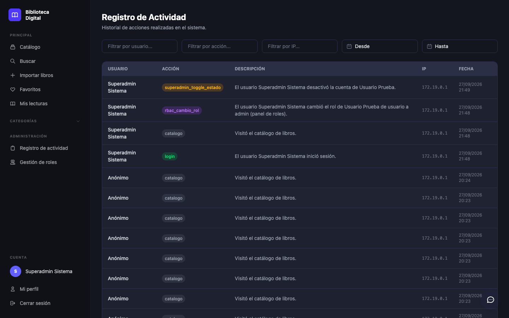
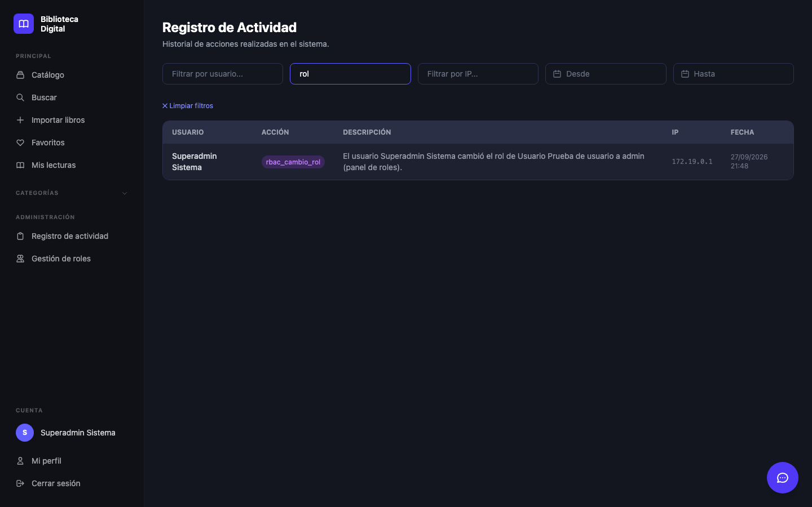

# Visor de auditoría — BibliotecaOnline

> Issue: #167 · Spec: [`specs/006-auditoria/`](../../specs/006-auditoria/spec.md) · Fecha: 2026-09-28

El visor de auditoría responde **quién hizo qué, a quién, desde dónde y cuándo**. Reutiliza el
sistema existente (`ActivityLog` + `LogActivityJob` + `App\Livewire\ActivityLogger`), sin tablas
nuevas (FR-001).

## 1. Qué se registra

| Acción (`accion`) | Origen | Ejemplo de descripción | Estado |
|---|---|---|---|
| `login` / `logout` | Eventos de Laravel (`AppServiceProvider`) | El usuario Ana inició sesión. | Existente |
| `catalogo` | `CatalogoController::index` | Visitó el catálogo de libros. | Existente |
| `busqueda` | `OpenLibraryController::buscar` | Búsqueda de libro: "dune". | Existente |
| `rbac_cambio_rol` | `RbacController::actualizar` (`/admin/roles`) | El usuario Ana cambió el rol de Luis de usuario a admin (panel de roles). | **Nuevo (#167)** |
| `superadmin_cambio_rol` | `SuperAdminController::cambiarRol` | El usuario Sofía cambió el rol de Luis de usuario a admin (panel de superadministrador). | **Nuevo (#167)** |
| `superadmin_toggle_estado` | `SuperAdminController::toggleEstado` | El usuario Sofía desactivó la cuenta de Luis. | **Nuevo (#167)** |
| `usuario_actualizado` | `UsuarioController::update` | El usuario Ana actualizó los datos de Luis (#7). | **Nuevo (#167)** |
| `usuario_eliminado` | `UsuarioController::destroy` | El usuario Ana eliminó al usuario Luis (#7). | **Nuevo (#167)** |

Reglas:
- Solo se registra una acción que **sí ocurrió**. Un cambio de rol rechazado (el propio rol o un rol
  inválido) no deja registro; lo verifican las pruebas.
- Las descripciones **no incluyen** contraseñas, tokens ni correos (FR-003; prueba
  `test_la_auditoria_no_guarda_datos_sensibles`).
- Los cambios de rol guardan el rol anterior y el nuevo, y desde qué panel se hicieron.
- Datos técnicos de la petición (ruta, método, duración, estado HTTP) **no** van aquí: pertenecen a la
  trazabilidad (spec 005, FR-007).

## 2. Visor (`/admin/logs`)

- **Acceso:** solo `admin` y `superadmin` (`role:admin,superadmin`). Un `usuario` recibe 403 y un
  invitado es redirigido a `/login`.
- **Columnas:** usuario (o "Anónimo"), acción (con color por tipo), descripción, IP y fecha/hora
  (zona `America/Hermosillo`).
- **Filtros** (combinables, en vivo):

  | Filtro | Cómo busca |
  |---|---|
  | Usuario | Nombre parcial; "Anónimo" muestra acciones sin sesión |
  | Acción | Texto parcial (p. ej. `rol` muestra ambos tipos de cambio de rol) |
  | **IP (nuevo)** | Prefijo: `10.0.0.5` exacta, `192.168.` toda la subred |
  | Desde / Hasta | Rango de fechas |

- **Paginación:** 20 registros por página. **Limpiar filtros** restablece todos, incluida la IP.
- **Detalle:** no se agrega una vista aparte; toda la información cabe en la fila (spec.md,
  Assumptions).
- **Accesibilidad:** cada filtro tiene `<label>` (oculto visualmente) o `aria-label`.

## 3. Cómo funciona el registro

```text
Acción administrativa → ActivityLog::registrar($accion, $descripcion)
   → LogActivityJob (cola)  → worker → tabla activity_logs → visor /admin/logs
```

El registro es **asíncrono**: si no hay un worker de colas procesando, los registros se quedan en la
tabla `jobs` y no aparecen en el visor.

| Entorno | Worker |
|---|---|
| Local | `composer dev` (incluye `queue:listen`) o `php artisan queue:work` |
| Entorno de liberación (#156) | Servicio `worker` de `docker-compose.release.yml` |
| Pruebas (PHPUnit) | `QUEUE_CONNECTION=sync`: el job se ejecuta al instante |

## 4. Pruebas

| Archivo | Pruebas | Qué cubre |
|---|---|---|
| `tests/Feature/ActivityLogTest.php` | 4 | `registrar()` guarda usuario/IP, sin sesión deja `user_id` nulo, se encola `LogActivityJob`, login/logout auditados |
| `tests/Feature/ActivityLoggerAccesoTest.php` | 4 | Invitado → login, `usuario` → 403, `admin` y `superadmin` → 200 |
| `tests/Feature/RbacAuditoriaTest.php` | 2 | Cambio de rol auditado; cambio rechazado no se audita |
| `tests/Feature/SuperAdminAuditoriaTest.php` | 4 | Activar, desactivar y cambiar rol auditados; rol inválido no se audita |
| `tests/Feature/UsuarioAuditoriaTest.php` | 3 | Actualizar y eliminar auditados; sin datos sensibles |
| `tests/Feature/ActivityLoggerFiltrosTest.php` | 7 | Filtro por IP (exacta y subred), sin regresión en usuario/"Anónimo"/acción/fecha, limpiar filtros, columnas visibles |

```bash
php artisan test --filter='ActivityLog|Auditoria'    # 24 pruebas
```

Suite completa: 142 pruebas (antes 118), todas verdes.

## 5. Evidencia

Entorno de liberación del #156 (`scripts/deploy.sh`), como `superadmin`: se cambió el rol de
"Usuario Prueba" en `/admin/roles` y se desactivó su cuenta en `/superadmin`. Ambas acciones
aparecen en el visor con autor, descripción, IP y fecha:



Filtro por acción `rol`:



## 6. Fuera de alcance

- `FavoritoController::toggle` y `PerfilController::actualizar`: son acciones del usuario sobre sus
  propios datos, no administrativas (spec.md). Se pueden agregar con una línea de
  `ActivityLog::registrar()` si el equipo lo decide.
- Retención o poda de `activity_logs`: no se identificó un problema de volumen (spec.md, Assumptions).
