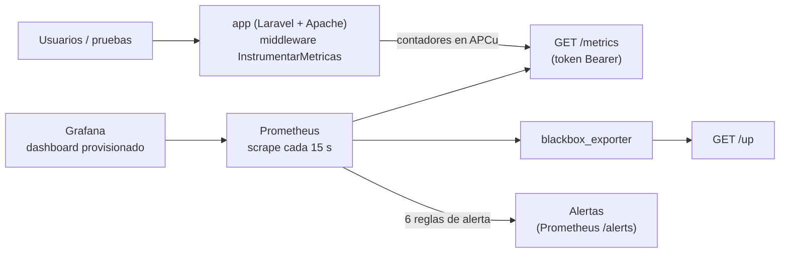

# Monitoreo con Prometheus y Grafana — BibliotecaOnline

> Issue: #165 · Spec: [`specs/004-monitoreo/`](../../specs/004-monitoreo/spec.md) · Fecha: 2026-09-28

Estados: **IMPLEMENTADO** (existe), **VALIDADO** (se ejecutó con el resultado indicado),
**PLANEADO** (propuesta).

---

## 1. Arquitectura



| Componente | Imagen / archivo | Puerto (host) | Estado |
|---|---|---|---|
| Instrumentación | `app/Http/Middleware/InstrumentarMetricas.php`, `app/Services/Metricas.php` | — | **VALIDADO** |
| Endpoint | `GET /metrics` → `MetricasController` | `8090` (con la app) | **VALIDADO** |
| Librería | `promphp/prometheus_client_php` 2.15.1 + APCu | — | **VALIDADO** |
| Prometheus | `prom/prometheus:v3.15.0` + `monitoring/prometheus/` | `9090` | **VALIDADO** |
| Disponibilidad | `prom/blackbox-exporter:v0.28.0` + `monitoring/blackbox/` | interno | **VALIDADO** |
| Grafana | `grafana/grafana:13.2.2` + `monitoring/grafana/` | `3000` | **VALIDADO** |
| Orquestación | `docker-compose.monitoring.yml` + `scripts/monitoring.sh` | — | **VALIDADO** |

**Decisiones** (spec 004, `research.md`):
- **Prometheus + Grafana** frente a Nagios, Zabbix y Datadog: la justificación está en
  [`research.md`](../../specs/004-monitoreo/research.md).
- **Librería:** `promphp/prometheus_client_php`, la opción candidata del plan. Es madura, no depende de
  Laravel y soporta varios almacenamientos.
- **Almacenamiento: APCu.** Es memoria compartida entre los procesos de Apache de un contenedor; sin
  ella, cada proceso tendría contadores distintos. Se descartan archivo (no es seguro entre procesos,
  como dice el plan) y Redis (sería otro servicio más). Sin APCu, en desarrollo y pruebas, se usa
  memoria de la petición (`METRICS_STORAGE=memory`).
- **Métricas de cola leídas de la BD en cada scrape**, no contadas en el worker. El worker es otro
  proceso (CLI) y no comparte APCu con Apache; leer `jobs` y `failed_jobs` da el valor real sin importar
  qué proceso las generó.
- **Stack integrado al entorno Docker del #156:** `docker-compose.monitoring.yml` usa el mismo proyecto y
  la misma red que `docker-compose.release.yml`, y Prometheus llega a la app como `app:80`.

## 2. Métricas

| Métrica | Tipo | Labels | Fuente | Estado |
|---|---|---|---|---|
| `bibliotecaonline_http_requests_total` | counter | `method`, `route`, `status` | Middleware, en cada respuesta | **VALIDADO** |
| `bibliotecaonline_http_request_duration_seconds` | histogram | `method`, `route` | Middleware (cubetas de 10 ms a 10 s; incluye 5 s = NS-1) | **VALIDADO** |
| `bibliotecaonline_http_errors_total` | counter | `clase` (`4xx`, `5xx`) | Middleware, si el estado ≥ 400 | **VALIDADO** |
| `bibliotecaonline_queue_jobs_pending` | gauge | — | `COUNT(*)` de `jobs` | **VALIDADO** |
| `bibliotecaonline_queue_jobs_failed` | gauge | — | `COUNT(*)` de `failed_jobs` | **VALIDADO** |
| `bibliotecaonline_database_up` | gauge | — | 1 si las consultas anteriores responden | **VALIDADO** |
| `bibliotecaonline_app_info` | gauge | `version`, `env` | `APP_VERSION` de la imagen | **VALIDADO** |
| `up{job="bibliotecaonline"}` | (Prometheus) | — | Resultado del scrape de `/metrics` | **VALIDADO** |
| `probe_success{job="disponibilidad"}`, `probe_duration_seconds` | (blackbox) | — | `GET /up` | **VALIDADO** |

**Reglas de los labels (US3, FR-003):**
- `route` es el **patrón** de la ruta (`/libros/{libro}`), nunca la URL real (`/libros/7`). Así se
  evita la alta cardinalidad y no se exponen IDs. Una URL sin ruta registrada (404) se agrupa como
  `sin_ruta`.
- Nunca se usa IP, user-agent, ID de usuario, correo ni parámetros. Lo verifica
  `test_las_metricas_no_exponen_ip_ni_usuario`.
- `/metrics` y `/up` no se miden a sí mismos, para no contar el propio scraping.

## 3. Acceso a `/metrics`

| Situación | Comportamiento |
|---|---|
| `METRICS_TOKEN` definido (entorno de liberación) | Exige `Authorization: Bearer <token>`; sin token o con uno incorrecto responde 403 |
| Sin token en `local` / `testing` | Abierto, para desarrollar y para las pruebas |
| Sin token en `production` | 403: nunca queda expuesto por accidente |

- La ruta se registra **fuera del grupo `web`**, sin sesión ni cookies: cada scrape no crea una fila
  en `sessions`.
- El token se genera aleatorio en `.env.release` (`scripts/prepare-release.sh`) y
  `scripts/monitoring.sh up` lo copia a `monitoring/.secretos/metrics_token` (ignorado por git), que
  Prometheus lee con `credentials_file`. **No hay secretos en el repositorio.**

## 4. Dashboard (Grafana)

"**BibliotecaOnline — Monitoreo**" (uid `bibliotecaonline`): se provisiona desde
`monitoring/grafana/dashboards/bibliotecaonline.json` y es el dashboard de inicio.

| Fila | Paneles |
|---|---|
| Estado actual | Disponibilidad (ARRIBA/CAÍDA) · Solicitudes por minuto · Tasa de errores 5xx · Latencia p95 (rojo ≥ 5 s) · Base de datos · Trabajos fallidos |
| Tráfico y latencia | Solicitudes/min por estado HTTP · Latencia promedio y p95 con línea de umbral en 5 s |
| Errores y disponibilidad | Errores/min por clase · Disponibilidad y tiempo de `/up` |
| Detalle | Rutas más solicitadas · Cola (pendientes/fallidos) · Versión desplegada |

Cubre lo mínimo de FR-004: solicitudes por minuto, errores, latencia promedio, p95 y
disponibilidad. Acceso: `http://127.0.0.1:3000`, usuario `admin`, contraseña `GRAFANA_ADMIN_PASSWORD`
de `.env.release`. El registro de usuarios y el acceso anónimo están desactivados.

## 5. Alertas

Definidas en `monitoring/prometheus/alerts.yml` y validadas con `promtool check rules` (6 reglas). Se
consultan en `http://127.0.0.1:9090/alerts`.

| Alerta | Condición | Ventana | Severidad | Origen del umbral |
|---|---|---|---|---|
| `BibliotecaOnlineNoDisponible` | `probe_success == 0` (`/up` falla) | 1 min | critical | Equipo |
| `BibliotecaOnlineSinMetricas` | `up{job="bibliotecaonline"} == 0` | 1 min | critical | Equipo |
| `BibliotecaOnlineBaseDeDatosCaida` | `bibliotecaonline_database_up == 0` | 1 min | critical | Equipo |
| `BibliotecaOnlineErrores5xx` | 5xx / total > 5 % (rate 5 min) | 2 min | warning | Equipo |
| `BibliotecaOnlineLatenciaP95` | p95 > 5 s (rate 5 min) | 5 min | warning | **Actividad (NS-1)** |
| `BibliotecaOnlineTrabajosFallidos` | `queue_jobs_failed > 0` | 5 min | warning | Equipo |

**PLANEADO:** enviar notificaciones (correo, Discord) con Alertmanager. Hoy las alertas se ven en
Prometheus y el estado en el dashboard.

## 6. Cómo ejecutarlo

```bash
scripts/prepare-release.sh v-local      # imagen (con APCu) y .env.release (token y contraseña de Grafana)
scripts/deploy.sh v-local               # app + worker + MySQL en http://127.0.0.1:8090
scripts/monitoring.sh up                # Prometheus :9090, Grafana :3000
scripts/monitoring.sh verify            # 7 verificaciones: targets, reglas, métricas, dashboard
RUN_K6=true scripts/test-release.sh     # (opcional) genera tráfico para ver datos
scripts/monitoring.sh down              # apaga solo el monitoreo
```

### Parámetros

| Variable | Default | Dónde | Descripción |
|---|---|---|---|
| `METRICS_STORAGE` | `memory` (`apcu` en `.env.release`) | `config/metricas.php` | Almacenamiento de contadores |
| `METRICS_TOKEN` | vacío (aleatorio en `.env.release`) | `config/metricas.php` | Token Bearer de `/metrics` |
| `GRAFANA_ADMIN_PASSWORD` | aleatoria en `.env.release` | `docker-compose.monitoring.yml` | Contraseña de `admin` en Grafana |
| `PROMETHEUS_PORT` / `GRAFANA_PORT` | `9090` / `3000` | `docker-compose.monitoring.yml` | Puertos en el host |
| `scrape_interval` | 15 s | `monitoring/prometheus/prometheus.yml` | Frecuencia de lectura |
| Retención | 7 días | `docker-compose.monitoring.yml` | Datos de Prometheus |
| `apc.shm_size` | 32 MB | `docker/php.ini` | Memoria de APCu |

## 7. Pruebas y verificación

| Qué | Cómo | Resultado |
|---|---|---|
| Endpoint, formato, contadores, labels y token | `tests/Feature/MetricasTest.php` (8 pruebas) | **VALIDADO** |
| Configuración y reglas | `promtool check config` / `check rules` | **VALIDADO** (6 reglas) |
| Stack funcionando | `scripts/monitoring.sh verify` | **VALIDADO** (7/7) |
| Datos reales | Humo + k6 contra el entorno: 8 404 solicitudes medidas, p95 = 49.7 ms | **VALIDADO** |
| Alertas disparándose y resolviéndose | MySQL detenido a propósito (ver §8) | **VALIDADO** (2 alertas en *firing*, resueltas al restaurar) |

## 8. Evidencia

Capturas del 2026-09-28 en el entorno de liberación `mon1` (carpeta `evidencias/`):

| Captura | Qué muestra |
|---|---|
| `monitoreo-prometheus-targets.png` | Targets `bibliotecaonline` (`/metrics` con token), `disponibilidad` (blackbox → `/up`) y `prometheus`: los 3 en **UP** |
| `monitoreo-prometheus-alertas.png` | Las 6 reglas cargadas desde `alerts.yml`, todas *inactive* con la app sana |
| `monitoreo-grafana-incidente.png` | Dashboard durante el incidente: base de datos **SIN CONEXIÓN**, **83.3 %** de errores 5xx |
| `monitoreo-alertas-firing.png` | Prometheus con **FIRING (2)**: `BaseDeDatosCaida` y `Errores5xx` |
| `monitoreo-grafana-dashboard.png` | Dashboard tras la recuperación: ráfaga de k6, incidente y regreso a la normalidad en 15 minutos |

### Prueba de alertas: incidente provocado

Se generó tráfico constante (~400 req/min) y se detuvo MySQL del entorno:

| Hora | Evento |
|---|---|
| 22:09:19 | `docker compose stop db`. `/catalogo` responde **500**; `/up` sigue en **200** (el health check de Laravel no revisa la BD) |
| ~22:09:36 | `BaseDeDatosCaida` → *pending* |
| 22:10:36 | `BaseDeDatosCaida` → **firing** (ventana de 1 min) · `Errores5xx` → *pending* |
| 22:12:37 | `Errores5xx` → **firing** (ventana de 2 min) |
| 22:13:15 | `docker compose start db`. `/catalogo` vuelve a **200** |
| 22:13:36 | `BaseDeDatosCaida` se resuelve |
| 22:17:58 | `Errores5xx` se resuelve: tarda ~4.5 min porque la tasa se calcula sobre 5 min de historia |

**Lecciones:**
- `/up` no detecta una caída de la base de datos. Sin la métrica `bibliotecaonline_database_up` y la
  alerta de 5xx, el incidente habría pasado como "disponible".
- Durante la prueba de k6 la cola llegó a **~4 000 trabajos pendientes** (un activity log por cada
  visita al catálogo) y el worker los desahogó en ~1 minuto. El panel de cola lo hace visible.

## 9. Limitaciones

- **Contadores en memoria:** APCu se reinicia al reiniciar el contenedor `app`. Prometheus lo maneja
  (`rate()` detecta los reinicios), pero los totales acumulados vuelven a cero.
- **Un solo contenedor `app`:** con varias réplicas, cada una tendría su APCu. Prometheus las
  scrapearía por separado y se sumarían en PromQL, lo cual es correcto, pero requiere descubrirlas.
- **Entorno efímero:** el stack vive junto al entorno de liberación local; no hay un servidor de
  monitoreo permanente (ver `docs/cicd/pipeline-liberacion-despliegue.md` §13).
- **Sin notificaciones:** falta Alertmanager (§5, PLANEADO).
