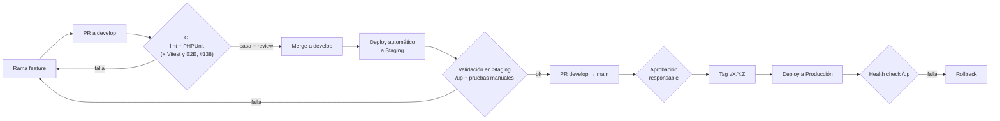

# Estrategia de despliegue — BibliotecaOnline

> Issue: #141
> Fuente de los datos: `.github/workflows/ci.yml`, `composer.json`, `package.json`, `.env.example`,
> `bootstrap/app.php`, `scripts/` e historial Git. Datos verificados el 2026-09-25.

Etiquetas usadas: **IMPLEMENTADO** (existe hoy), **VALIDADO** (existe y se comprobó que funciona),
**PLANEADO** (propuesta, no existe todavía).

---

## 1. Estado actual

**No existe hosting ni despliegue.** El repositorio no contiene workflows de deploy, archivos de
infraestructura (Dockerfile, devcontainer, configuración de proveedor) ni ambientes de GitHub. La
aplicación solo se ejecuta en las máquinas de los integrantes.

| Aspecto | Situación real | Estado |
|---|---|---|
| Stack | Laravel 12, PHP ^8.2, Vite + Tailwind 4 + Alpine.js | **IMPLEMENTADO** |
| Ejecución local | `composer dev` (levanta `php artisan serve`, `queue:listen`, `pail` y `vite` en paralelo) o `php artisan serve` + `npm run dev` | **IMPLEMENTADO** |
| Base de datos local | `.env.example` usa `DB_CONNECTION=sqlite`; algunos integrantes usan MySQL | **IMPLEMENTADO** |
| Colas | Se usan colas de Laravel (ej. registro de activity logs, PR #132) | **IMPLEMENTADO** |
| CI | Lint + PHPUnit en cada push/PR a `main` y `develop` | **IMPLEMENTADO** |
| Respaldos | `scripts/backup.sh` y `scripts/restore.sh` (mysqldump sobre la BD del `.env`) | **IMPLEMENTADO** |
| Health check | Ruta `/up` registrada en `bootstrap/app.php` (`health: '/up'`) | **IMPLEMENTADO** |
| Versiones | Tags `v1.0.0` (en `main`) y `v2.0.0` (solo en `develop`) | **IMPLEMENTADO** |
| Hosting / Staging / Producción | No existen | — |
| Devcontainer | No existe (issue #138) | **PLANEADO** |

Todo lo que sigue a partir de la sección 2 es **PLANEADO**.

---

## 2. Ambientes — **PLANEADO**

| Ambiente | Rama origen | Propósito | BD | `APP_ENV` / `APP_DEBUG` |
|---|---|---|---|---|
| Development | ramas de trabajo | Desarrollo local de cada integrante | SQLite o MySQL local | `local` / `true` |
| Staging | `develop` | Validar la integración antes de liberar; demo para revisión | MySQL propia, datos de prueba (seeders) | `staging` / `false` |
| Production | `main` (tag) | Uso real | MySQL propia, con respaldos | `production` / `false` |

Reglas:

- Cada ambiente tiene su propio `.env` y su propia base de datos; nunca se comparten credenciales.
- Staging se parece lo más posible a producción (misma versión de PHP, MySQL y driver de colas).

---

## 3. Pipeline conceptual — **PLANEADO**

---

## 4. Gates (condiciones para avanzar) — **PLANEADO**

| Paso | Condición |
|---|---|
| PR → `develop` | CI verde (lint, formato, PHPUnit) + 1 aprobación de otro integrante |
| `develop` → Staging | Merge completado; build y migraciones sin error |
| Staging → PR a `main` | `/up` responde 200; flujos principales probados (login, catálogo, favoritos, panel admin) |
| PR → `main` | CI verde + aprobación del responsable de release |
| Producción | Respaldo de BD previo exitoso; `/up` responde 200 tras el deploy |

Se habilitarán mediante *branch protection* (requerir checks y revisión) y *GitHub Environments*
(`staging`, `production`) con revisores requeridos para `production`.

---

## 5. Migraciones — **PLANEADO**

1. Ejecutar `scripts/backup.sh` antes de migrar en producción.
2. Ejecutar `php artisan migrate --force` como paso del deploy (ya se usa `--force` en CI).
3. Las migraciones deben ser reversibles (`down()` implementado) y no destructivas en el mismo
   release en que se deja de usar una columna.
4. Nunca editar una migración ya aplicada; crear una nueva (ver PR #127, migración duplicada).

---

## 6. Variables de entorno y secretos — **PLANEADO**

- `.env.example` es la referencia versionada de variables; `.env` nunca se sube (ya está en
  `.gitignore` — **IMPLEMENTADO**).
- En los servidores, el `.env` se genera desde **GitHub Secrets** por ambiente
  (`APP_KEY`, `DB_*`, `MAIL_*`, credenciales de APIs externas).
- `APP_KEY` distinto por ambiente; `APP_DEBUG=false` fuera de Development.
- Rotar secretos si se exponen en un log o commit.

---

## 7. Artefactos — **PLANEADO**

Un workflow de release construye un artefacto por tag:

- `composer install --no-dev --optimize-autoloader`
- `npm ci && npm run build` (assets en `public/build`)
- Empaquetar en un `.tar.gz` con el nombre del tag y adjuntarlo al GitHub Release.

En el servidor se ejecuta después: `php artisan config:cache`, `route:cache`, `view:cache` y
`queue:restart`.

---

## 8. Rollback — **PLANEADO**

1. Volver a desplegar el artefacto del tag anterior (`vX.Y.Z-1`).
2. Si la versión fallida aplicó migraciones: `php artisan migrate:rollback` o, si hubo pérdida de
   datos, `scripts/restore.sh` con el respaldo tomado antes del deploy.
3. Verificar `/up` y abrir un issue `fix/` describiendo la causa.

---

## 9. Aprobaciones y responsables — **PLANEADO**

| Rol | Responsabilidad |
|---|---|
| Autor del PR | Rama, pruebas locales, descripción del PR con `Closes #N` |
| Revisor (otro integrante) | Code review y aprobación del PR a `develop` |
| Responsable de release (rotativo) | Validar Staging, aprobar PR `develop → main`, crear tag, supervisar deploy y rollback |
| Dueño del repositorio | Configurar branch protection, Environments y Secrets |

---

## 10. Health checks — **PLANEADO** (la ruta ya existe)

- Endpoint: `GET /up` (Laravel, **IMPLEMENTADO**) — responde 200 si la app arranca.
- Uso previsto: paso final del workflow de deploy (`curl -f https://<host>/up`) y monitor externo de
  disponibilidad.
- Extensión opcional: verificar conexión a BD y cola dentro del evento `DiagnosingHealth`.
