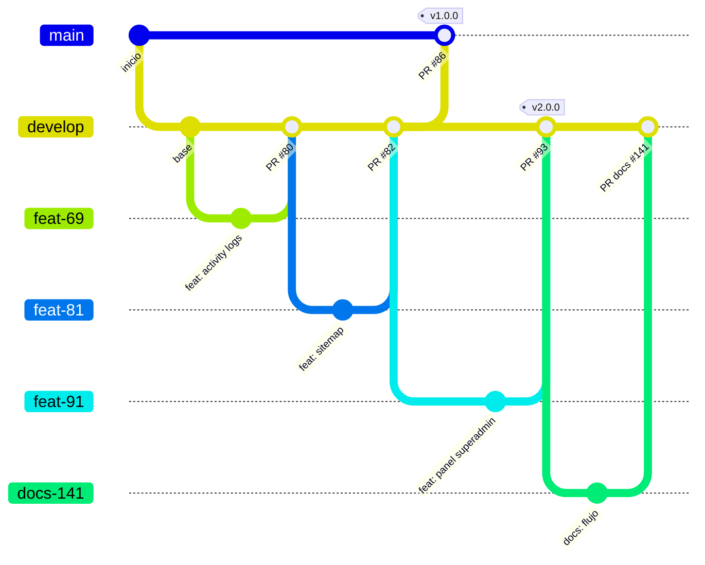
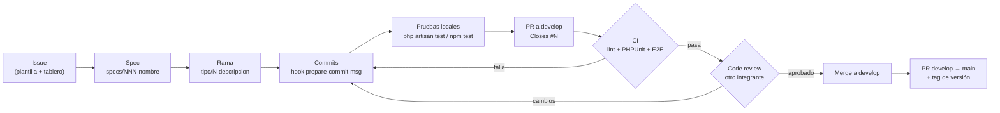

# Flujo de control de versiones — BibliotecaOnline

> Issue: #141
> Fuente de los datos: historial Git (`git log`, `git branch -r`, `git tag`), `.github/workflows/ci.yml`,
> `.github/ISSUE_TEMPLATE/`, `.git/hooks/prepare-commit-msg` y `ASIGNACIONES.md`.
> Datos verificados el 2026-09-25.

Cada elemento se etiqueta con su estado real:

| Etiqueta | Significado |
|---|---|
| **IMPLEMENTADO** | Existe en el repositorio o en la configuración y se usa hoy. |
| **VALIDADO** | Además de existir, se comprobó que funciona (ej. CI ejecutándose en PRs reales). |
| **PLANEADO** | Propuesta o acuerdo a futuro. No existe todavía. |

---

## 1. Ramas principales

| Rama | Propósito | Estado |
|---|---|---|
| `main` | Rama estable / de entrega. Solo debe recibir código de `develop` mediante PR. | **IMPLEMENTADO** |
| `develop` | Rama de integración. Todas las ramas de trabajo abren su PR hacia aquí. | **IMPLEMENTADO** |

Situación actual observada:

- El último merge en `main` es el PR #86 (2026-03-13), que coincide con el tag `v1.0.0`.
- `develop` va **82 commits por delante** de `main`.
- El tag `v2.0.0` (PR #93, 2026-03-15) apunta a un commit que **solo existe en `develop`**, nunca se
  integró a `main`.
- Regla de trabajo documentada en `ASIGNACIONES.md`: nunca trabajar directo en `main` ni en `develop`.

Acciones propuestas — **PLANEADO**:

- Abrir un PR `develop → main` para sincronizar `main` y etiquetar ahí la siguiente versión.
- A partir de entonces, crear los tags de versión únicamente sobre commits de `main`.

---

## 2. Nombres de ramas

### 2.1 Estado actual — **IMPLEMENTADO** (con inconsistencias)

Formato usado mayoritariamente: `tipo/<número-de-issue>-descripcion-corta`, por ejemplo:

- `feat/69-registro-activity-logs`
- `fix/116-eliminar-ruta-login-super`
- `chore/123-eliminar-migracion-duplicada`
- `perf/favorito-eager-loading`
- `test/106-selenium-ide`
- `docs/5-readme-instalacion`

Conteo de ramas remotas por prefijo:

| Prefijo | Ramas |
|---|---|
| `feature/` | 17 |
| `feat/` | 14 |
| `fix/` | 12 |
| `chore/` | 3 |
| `perf/` | 2 |
| `test/` | 2 |
| `docs/` | 1 |
| Sin convención (`fix-arreglo`, `hore/...`, `32-feat-vista-...`, `revert-74-feature...`) | 4 |

Inconsistencias detectadas:

1. Conviven `feature/` y `feat/` para el mismo tipo de trabajo.
2. `ASIGNACIONES.md` indica usar `feature/nombre-del-issue`, pero el hook `prepare-commit-msg`
   **rechaza** el tipo `feature` (solo acepta tipos de Conventional Commits).
3. Algunas ramas no incluyen número de issue (`perf/favorito-eager-loading`) o no siguen el formato.

### 2.2 Convención futura — **PLANEADO**

```
<tipo>/<número-issue>-<descripcion-en-kebab-case>
```

- `tipo` ∈ `feat | fix | docs | ci | chore | test | perf | refactor | style | build | revert`
- El número de issue es obligatorio (permite que el hook agregue `Fixes: #N`).
- Se deja de usar `feature/`; se actualiza `ASIGNACIONES.md` para reflejarlo.
- Las ramas se borran después del merge.

---

## 3. Convención de commits

### 3.1 Conventional Commits — **IMPLEMENTADO**

Formato: `tipo(scope): descripción en español`. Ejemplos reales del historial:

```
feat: implementar página de error 404 personalizada
perf: agregar eager loading anidado en FavoritoController para evitar N+1
fix(vitest): excluir specs de Playwright de la suite vitest
```

### 3.2 Hook `prepare-commit-msg` — **IMPLEMENTADO (solo local, no versionado)**

Ubicación: `.git/hooks/prepare-commit-msg`. Comportamiento:

1. Se omite en commits de merge.
2. Toma el **tipo** del prefijo de la rama y lo valida contra
   `feat|fix|chore|docs|style|refactor|perf|test|ci|build|revert`. Si no es válido, aborta el commit.
3. Toma el **scope** de la primera palabra después del número de issue
   (`docs/141-flujo-control-versiones` → `flujo`).
4. Construye el título `tipo(scope): mensaje` y verifica que no exceda **72 caracteres**.
5. Verifica que ninguna línea del cuerpo exceda **100 caracteres**.
6. Agrega al mensaje las líneas `Branch: <rama>` y, si hay número, `Fixes: #<issue>`.

Consecuencia práctica: el mensaje de `git commit -m` debe escribirse **sin** prefijo, porque el hook
lo añade.

Limitación: `.git/hooks` no se sube al repositorio, por lo que cada integrante debe copiarlo a mano y
no hay garantía de que todos lo tengan.

Propuesta — **PLANEADO**: versionarlo en `.githooks/prepare-commit-msg` y configurarlo con
`git config core.hooksPath .githooks` (documentado en el README).

---

## 4. Issues, Pull Requests y revisión de código

| Elemento | Detalle | Estado |
|---|---|---|
| Plantillas de issue | `.github/ISSUE_TEMPLATE/`: `bug_report.yml`, `feature_request.yml`, `task.yml` | **IMPLEMENTADO** |
| Tablero | GitHub Project del equipo con columnas por estado | **IMPLEMENTADO** |
| Una rama por issue | Regla en `ASIGNACIONES.md` | **IMPLEMENTADO** |
| PR hacia `develop` | Todos los PRs de trabajo apuntan a `develop` (ej. #121–#142) | **VALIDADO** |
| Descripción del PR | Qué se hizo, cómo probarlo, capturas si hay cambios visuales, `Closes #N` | **IMPLEMENTADO** (acuerdo) |
| Revisión obligatoria | Un integrante distinto al autor aprueba; no se mergea el propio PR | **IMPLEMENTADO** (acuerdo) |
| Estrategia de merge | Merge commit (`Merge pull request #N from ...`) | **VALIDADO** (historial) |
| Protección de ramas en GitHub | Requerir revisión y CI verde para mergear a `main`/`develop` | **PLANEADO** — pendiente confirmar configuración en *Settings → Branches* |

---

## 5. Integración continua (CI)

Archivo: `.github/workflows/ci.yml` — **IMPLEMENTADO**.

Disparadores: `push` y `pull_request` sobre `main` y `develop`.

| Job | Pasos |
|---|---|
| `lint-format` (ESLint + Prettier) | Node 20 → `npm ci` → `npm run lint` → `npm run format:check` |
| `php-tests` (PHPUnit) | PHP 8.2 + xdebug → `composer install` → `.env` de ejemplo → `key:generate` → `migrate --force` (SQLite en memoria) → `php artisan test` |
| `e2e-playwright` (E2E Playwright) — **IMPLEMENTADO** (issue #138) | PHP 8.2 + Node 20 → dependencias → `.env` + `key:generate` → SQLite en archivo con `migrate --seed` → `npm run build` → `php artisan serve` + espera a `/up` → Chromium → `npx playwright test` → reporte como artefacto |

Detalle y evidencia del job E2E: [`specs/003-infraestructura-cicd/`](../../specs/003-infraestructura-cicd/research.md).

No cubierto actualmente por CI:

- Pruebas unitarias JS con Vitest (`npm test`) — **PLANEADO**, aunque la constitución lo exige como
  puerta de calidad.

---

## 6. Relación con SDD (Spec-Driven Development)

**IMPLEMENTADO** — GitHub Spec Kit 1.0.12 se adoptó en el PR #144 (issue #136): configuración en
`.specify/`, constitución en `.specify/memory/constitution.md`, specs en `specs/NNN-nombre/` y guía en
`docs/sdd/sdd-implementation.md`. Primera spec: `specs/003-infraestructura-cicd/` (issue #138).

Flujo:

1. El issue describe el *qué* y los criterios de aceptación.
2. Se escribe o actualiza la spec (`specs/NNN-nombre/`) antes del código.
3. La rama, los commits y el PR referencian tanto el issue como la spec.
4. La revisión del PR valida el código contra la spec.

---

## 7. Diagramas

### 7.1 Modelo de ramas



> Nota: los nombres de rama se simplifican (`feat-69` = `feat/69-...`) porque Mermaid no admite `/`
> en todos los renderizadores. El tag `v2.0.0` sobre `develop` refleja la situación real descrita en
> la sección 1.

### 7.2 Flujo de un cambio


