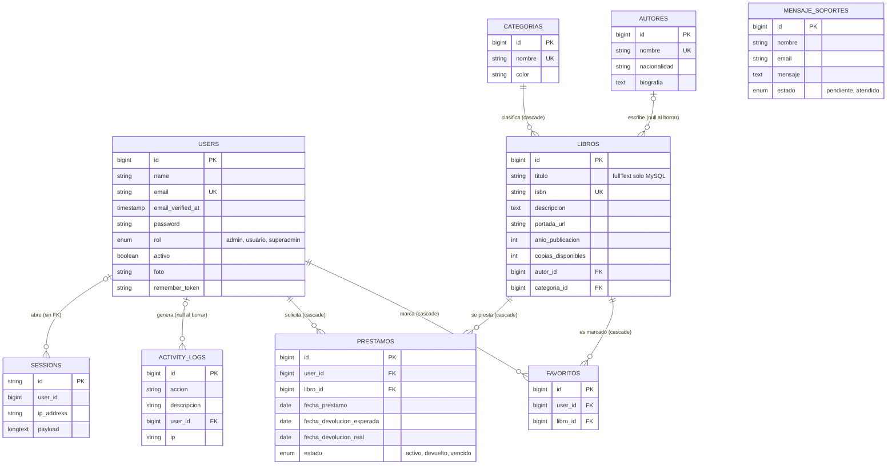

# Diagrama entidad-relación de BibliotecaOnline

Issue #135 · Fecha: 2026-09-25

El diagrama se derivó de las 15 migraciones de `database/migrations/` y de los modelos de
`app/Models/`, no de una base de datos en ejecución. Muestra las tablas del dominio y las de soporte
que se relacionan con ellas. Las tablas técnicas de Laravel (`cache`, `cache_locks`, `jobs`,
`job_batches`, `failed_jobs`, `password_reset_tokens`) no tienen relaciones y se listan aparte.

## 1. Diagrama

Todas las tablas del dominio también tienen `created_at` y `updated_at` (`timestamps()`), omitidas del
diagrama por brevedad. `SESSIONS.user_id` es un índice, no una clave foránea.
`MENSAJE_SOPORTES` no se relaciona con ninguna tabla.

## 2. Entidades

| Tabla | Modelo | Clave primaria | Descripción |
|---|---|---|---|
| `users` | `User` | `id` | Cuentas; `rol` define permisos; `activo` permite desactivar la cuenta |
| `autores` | `Autor` | `id` | Autores de libros |
| `categorias` | `Categoria` | `id` | Categorías con color (`#6366f1` por defecto) |
| `libros` | `Libro` | `id` | Catálogo |
| `favoritos` | `Favorito` | `id` | Relación muchos a muchos entre usuarios y libros |
| `prestamos` | `Prestamo` | `id` | Préstamos; sin rutas ni controlador hoy |
| `activity_logs` | `ActivityLog` | `id` | Registro de acciones (login, logout, catálogo, búsquedas) |
| `mensaje_soportes` | `MensajeSoporte` | `id` | Mensajes del chat de soporte |
| `sessions` | (ninguno) | `id` (string) | Sesiones de Laravel |
| `password_reset_tokens` | (ninguno) | `email` | Tokens de recuperación de contraseña |
| `cache`, `cache_locks` | (ninguno) | `key` | Caché en base de datos |
| `jobs`, `job_batches`, `failed_jobs` | (ninguno) | `id` | Cola en base de datos |

## 3. Relaciones

| Origen | Destino | Cardinalidad | Eloquent | Regla de borrado |
|---|---|---|---|---|
| `autores` | `libros` | 1 a N (autor opcional en el libro) | `Autor::libros` / `Libro::autor` | `nullOnDelete` |
| `categorias` | `libros` | 1 a N (categoría obligatoria) | `Categoria::libros` / `Libro::categoria` | `cascadeOnDelete` |
| `users` | `favoritos` | 1 a N | `User::favoritos` / `Favorito::usuario` | `cascade` |
| `libros` | `favoritos` | 1 a N | `Favorito::libro` (sin inversa en `Libro`) | `cascade` |
| `users` | `prestamos` | 1 a N | `Prestamo::user` (sin inversa en `User`) | `cascadeOnDelete` |
| `libros` | `prestamos` | 1 a N | `Libro::prestamos` / `Prestamo::libro` | `cascadeOnDelete` |
| `users` | `activity_logs` | 1 a N (usuario opcional) | `ActivityLog::user` (sin inversa en `User`) | `nullOnDelete` |

## 4. Claves foráneas

| Columna | Referencia | Migración |
|---|---|---|
| `libros.autor_id` (nullable) | `autores.id` | `2026_03_10_000003_create_libros_table` |
| `libros.categoria_id` | `categorias.id` | `2026_03_10_000003_create_libros_table` |
| `prestamos.user_id` | `users.id` | `2026_03_10_000004_create_prestamos_table` |
| `prestamos.libro_id` | `libros.id` | `2026_03_10_000004_create_prestamos_table` |
| `favoritos.user_id` | `users.id` | `2026_03_13_011958_crear_tabla_favoritos` |
| `favoritos.libro_id` | `libros.id` | `2026_03_13_011958_crear_tabla_favoritos` |
| `activity_logs.user_id` (nullable) | `users.id` | `2026_03_13_061637_create_activity_logs_table` |

## 5. Índices y restricciones relevantes

| Restricción | Tabla | Detalle |
|---|---|---|
| Único | `users.email` | Un correo por cuenta |
| Único | `categorias.nombre` | Sin categorías repetidas |
| Único (admite NULL) | `libros.isbn` | ISBN irrepetible |
| Único | `autores.nombre` | Añadido en `2026_08_18_133601...`; falla si ya hay nombres duplicados |
| Único compuesto | `favoritos(user_id, libro_id)` | Un usuario no repite un libro |
| Índice de texto completo | `libros.titulo` | Solo en MySQL (la migración lo omite en otros motores, como SQLite de pruebas) |
| Índice | `sessions.user_id`, `sessions.last_activity`, `jobs.queue`, `cache.expiration` | Soporte de Laravel |
| Enum | `users.rol`, `prestamos.estado`, `mensaje_soportes.estado` | Valores en la tabla de entidades |

## 6. Observaciones

- `users.rol` nació como enum de dos valores (`admin`, `usuario`) y se amplió con `superadmin` en una
  migración posterior (`->change()`); `MigracionRolSuperadminTest` cubre ese cambio.
- `Libro` no define la relación inversa `favoritos()`, y `User` no define `prestamos()` ni
  `activityLogs()`: las tablas relacionan, pero el modelo no expone todas las direcciones.
- Existió una migración duplicada eliminada en el Issue #123 (PR #127); no aparece en el estado actual.
