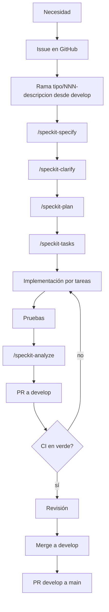

# Guía de implementación de SDD en BibliotecaOnline

Guía de uso diario para llevar un requerimiento desde el Issue hasta el merge con GitHub Spec Kit.
Reglas de fondo: [`.specify/memory/constitution.md`](../../.specify/memory/constitution.md).
Instalación: [`guia-instalacion-spec-kit.md`](guia-instalacion-spec-kit.md).

## 1. Objetivo

Que cada cambio significativo nazca de una especificación revisable, y que se pueda seguir el
camino Issue → Spec → Tasks → código → pruebas → PR sin huecos.

## 2. Beneficios

- Los criterios de aceptación existen antes de programar, así que las pruebas salen de ellos.
- Las decisiones técnicas quedan escritas (`plan.md`, `research.md`) y se revisan en el PR.
- `/speckit-analyze` detecta contradicciones entre spec, plan y tareas antes de implementar.
- Cualquier integrante entiende un módulo leyendo su spec, sin depender de quien lo escribió.

## 3. Flujo SDD



## 4. Roles del equipo

| Rol | Responsabilidad |
|---|---|
| Autor/a | Crea el Issue, la rama y la spec; implementa; abre el PR |
| Revisor/a | Persona distinta de la autora: revisa spec, código, pruebas y evidencias antes del merge |
| Responsable de CI | Mantiene `.github/workflows/` y decide qué checks son obligatorios |
| Responsable de la constitución | Propone enmiendas y verifica su cumplimiento en los PR |

Con un equipo de dos integrantes, los roles de revisión se alternan.

## 5. Cómo nace un requerimiento

Un requerimiento surge de una necesidad de usuarios, un bug o una deuda técnica. Se acepta cuando se
puede describir como una historia de usuario con resultado verificable. Si es trivial (typo, ajuste
de estilo, dependencia) no necesita spec, pero sí Issue.

## 6. Crear el Issue

Usar las plantillas de `.github/ISSUE_TEMPLATE/` (bug, nueva funcionalidad, tarea). El título lleva
el tipo de rama como prefijo (`feat:`, `fix:`, `docs:`, `chore:`, `ci:`). Anotar el número: irá en la
rama, el commit y el PR.

## 7. Crear la spec

Con la rama creada y Claude Code abierto en el repositorio:

```
/speckit-specify Como usuario nuevo quiero un recorrido guiado que me enseñe las funciones principales
```

Genera `specs/<NNN-nombre>/spec.md` con historias priorizadas, requisitos y criterios de
aceptación. La spec describe **qué y por qué**, no la tecnología. Si Spec Kit numera de forma
distinta a la esperada, renombrar la carpeta antes del commit.

## 8. Clarificación

`/speckit-clarify` hace hasta 5 preguntas sobre huecos de la spec y escribe las respuestas en
ella. Se ejecuta antes del plan. Es opcional para specs pequeñas.

## 9. Plan

`/speckit-plan Laravel 12, Livewire 4, Alpine.js, Tailwind 4` produce `plan.md`, `research.md` y
demás artefactos de diseño. Debe respetar la constitución; cualquier complejidad añadida se
justifica ahí.

## 10. Tasks

`/speckit-tasks` genera `tasks.md`, ordenado por dependencias y agrupado por historia de usuario.
Cada tarea nombra archivos concretos. Opcionalmente `/speckit-taskstoissues` las convierte en
Issues (requiere el servidor MCP de GitHub).

## 11. Rama

Formato `tipo/NNN-descripcion` desde `develop`, por ejemplo `feat/150-guia-interactiva`. Tipos
válidos: `feat|fix|chore|docs|style|refactor|perf|test|ci|build|revert`. El hook local
`prepare-commit-msg` toma de ahí el tipo y el número de Issue; **una rama sin número hace fallar el
commit**. El hook se instala manualmente (paso 5 del README).

## 12. Código

Implementar tarea por tarea con `/speckit-implement` o a mano, con commits pequeños. Cambios de
esquema solo por migraciones; rutas protegidas con `auth` y `role:` según corresponda.

## 13. Pruebas

Según el riesgo: PHPUnit (Unit/Feature), Playwright (flujos de navegador), Vitest (JavaScript).
Cambios de seguridad incluyen pruebas negativas. Comandos:

```bash
php artisan test
npm run build && npx playwright test   # con el servidor Laravel en 127.0.0.1:8000
npm run lint
npm run format:check
npm run test
```

## 14. Analyze

`/speckit-analyze` compara spec, plan y tasks y reporta inconsistencias (solo lectura). Se guarda
la salida como `analysis.md` en la carpeta de la spec y se corrigen los hallazgos críticos antes del
PR. Si el código se aparta de la spec, `/speckit-converge` agrega las tareas pendientes.

## 15. PR

Abrir el PR hacia `develop` con la plantilla `.github/PULL_REQUEST_TEMPLATE.md`: `Closes #NNN`,
enlace a la spec, cambios, cómo validar, pruebas ejecutadas con resultados reales y evidencias.

## 16. CI

El PR debe tener los checks en verde. Hoy el workflow ejecuta ESLint, Prettier y PHPUnit; Playwright
y Vitest están planeados (Issue #138). No se hace merge con un check requerido en rojo.

## 17. Review

La revisora verifica: spec vinculada y coherente con el cambio, pruebas proporcionales al riesgo,
constitución respetada, ausencia de secretos y evidencia real.

## 18. Merge

Merge a `develop` desde GitHub (no commits directos). `main` se actualiza solo con un PR desde
`develop`, cuando `develop` está estable.

## 19. Despliegue

La estrategia de ambientes está en `docs/planeacion/estrategia-despliegue.md` (Issue #141) y su
estado se marca allí como IMPLEMENTADO, VALIDADO o PLANEADO. Esta guía no presupone que exista un
ambiente de producción.

## 20. Seguimiento

Cada Issue se cierra con `Closes #NNN` al hacer merge. El tablero del proyecto en GitHub refleja el
estado. La matriz de [`estado-actual/trazabilidad.md`](estado-actual/trazabilidad.md) se actualiza
al cerrar un módulo.

## 21. Indicadores

Se calculan con datos reales de GitHub, sin estimaciones:

| Indicador | Fuente |
|---|---|
| Issues con spec vinculada / issues funcionales | Issues y carpeta `specs/` |
| PRs con CI en verde al primer intento | GitHub Actions |
| Pruebas PHPUnit / Playwright / Vitest aprobadas | Salida de los comandos |
| Tiempo de Issue a merge | Fechas de Issue y PR |

## 22. Definition of Ready

Un Issue está listo para trabajarse cuando:
- [ ] Tiene título con prefijo de tipo y descripción clara.
- [ ] Tiene responsable.
- [ ] Tiene criterios de aceptación verificables.
- [ ] Si es significativo, tiene o tendrá su spec antes de codificar.
- [ ] No depende de un Issue bloqueante sin resolver.

## 23. Definition of Done

- [ ] Spec, plan y tasks actualizados con lo realmente implementado.
- [ ] Código y pruebas en el PR; `php artisan test`, lint, formato y Vitest en verde.
- [ ] Pruebas negativas si toca autenticación, roles o rutas protegidas.
- [ ] Documentación actualizada.
- [ ] CI en verde y PR revisado por otra persona.
- [ ] Issue vinculado y cerrado por el merge.
- [ ] Sin secretos en el diff.

## 24. Política para bugs

1. Issue con plantilla de bug (pasos, esperado, actual).
2. Rama `fix/NNN-descripcion`.
3. Primero una prueba que reproduce el bug y falla; luego la corrección.
4. Si el bug revela un requisito mal especificado, se corrige también la spec.
5. Un bug de seguridad (por ejemplo una ruta sin `role:`) tiene prioridad sobre el trabajo nuevo.

## 25. Política para cambios urgentes

Un cambio urgente (falla en producción o brecha de seguridad) puede omitir la clarificación y la
spec completa, pero **no** el Issue, la rama, el PR, las pruebas ni el CI. Se documenta una spec
breve después, en el mismo PR o en uno inmediato. Nunca se hace commit directo a `main`.

## 26. Trazabilidad

Se mantiene la cadena Issue → spec → tasks → código → prueba → PR mediante el número de Issue en la
rama, el commit (`Fixes: #NNN`, agregado por el hook) y el PR (`Closes #NNN`), y la ruta de la spec
en la descripción del PR. La matriz global está en
[`estado-actual/trazabilidad.md`](estado-actual/trazabilidad.md).

## 27. Mantener la documentación

- La spec se actualiza en el mismo PR que cambia el comportamiento.
- Los documentos de `docs/` y este mismo archivo se revisan cuando cambia el flujo.
- Las etiquetas IMPLEMENTADO, VALIDADO y PLANEADO se actualizan al cambiar el estado; nunca se
  marca como implementado algo solo planeado.
- Las enmiendas a la constitución suben su versión y se explican en el PR.

## Ejemplo: cómo un requerimiento futuro genera spec, plan y tasks

1. Issue #200 `feat: filtro por año en el catálogo`.
2. `git checkout develop && git pull && git checkout -b feat/200-filtro-anio-catalogo`.
3. `/speckit-specify Como lector quiero filtrar el catálogo por año de publicación`.
4. `/speckit-clarify`, `/speckit-plan`, `/speckit-tasks`.
5. Implementar, probar, `/speckit-analyze`, guardar `analysis.md`.
6. Commit, push y PR a `develop` con `Closes #200` y enlace a `specs/NNN-filtro-anio-catalogo/`.

Los pasos anteriores describen el proceso; el número de spec y del Issue del ejemplo son ilustrativos.
