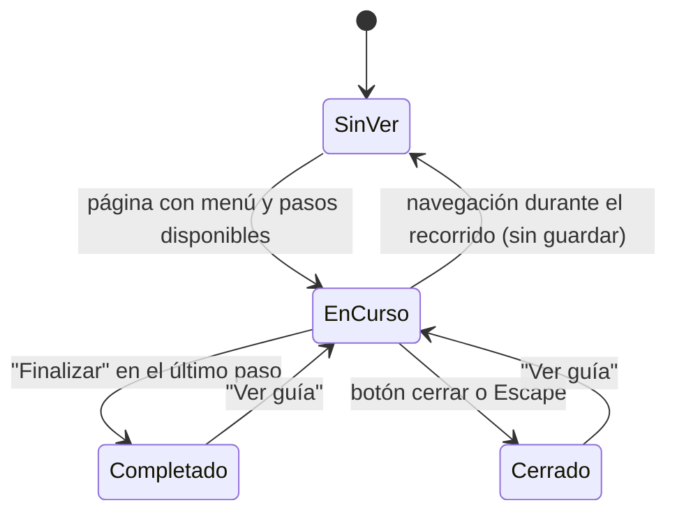

# Data Model: Guía interactiva para usuarios nuevos

No hay tablas ni migraciones nuevas. Las dos entidades de la spec viven en el código JavaScript y en
`localStorage`.

## Paso del recorrido (`PasoTour`)

Definido en `resources/js/tour/tour-logic.js` (planeado).

| Campo | Tipo | Descripción |
|---|---|---|
| `id` | string | `bienvenida`, `catalogo`, `buscar`, `favoritos` o `perfil` |
| `ancla` | string o `null` | Selector `[data-tour="<id>"]`; `null` para la bienvenida (paso centrado) |
| `titulo` | string | Título en español |
| `descripcion` | string | Texto breve en español |
| `lado` | `top`, `right`, `bottom` o `left` | Posición del popover (`right` en el menú lateral) |
| `requiereSesion` | boolean | `true` para `perfil`; informativo, la disponibilidad real se decide por la presencia del ancla |

### Pasos definidos

| Orden | `id` | Ancla | Título | Texto |
|---|---|---|---|---|
| 1 | `bienvenida` | ninguna | Bienvenido a BibliotecaOnline | Te mostraremos en un minuto lo más importante. Puedes cerrar esta guía cuando quieras. |
| 2 | `catalogo` | `[data-tour="catalogo"]` | Catálogo | Explora todos los libros disponibles. |
| 3 | `buscar` | `[data-tour="buscar"]` | Buscador | Busca por título o autor y filtra por categoría. |
| 4 | `favoritos` | `[data-tour="favoritos"]` | Favoritos | Guarda los libros que te interesan para verlos después. |
| 5 | `perfil` | `[data-tour="perfil"]` | Mi perfil | Actualiza tus datos y tu foto. |

Los textos son propuestas para revisar con el equipo antes de implementar.

## Estado del recorrido (`EstadoTour`)

Guardado en `localStorage` del navegador.

| Elemento | Valor |
|---|---|
| Clave (visitante) | `bo_tour_visto:guest` |
| Clave (usuario con sesión) | `bo_tour_visto:user:<id>` |
| Valor | JSON `{ "resultado": "completado" \| "cerrado", "fecha": "<ISO 8601>" }` |
| Ausencia de clave | La persona no ha visto el recorrido: se inicia solo |
| Clave presente | No se inicia solo; solo se relanza desde "Ver guía" |
| Relanzar | Se elimina la clave y se inicia el recorrido |

### Reglas

- `<id>` es el id numérico del usuario autenticado, tomado del atributo `data-tour-usuario` del menú.
- Un valor no válido o ilegible se trata como ausente.
- Si `localStorage` lanza una excepción (modo privado, bloqueado), se ignora: el recorrido se muestra una
  vez en la sesión y no se recuerda.

### Transiciones

## Relación con la base de datos

Ninguna. Ver [research.md](research.md), sección 5, para la alternativa descartada (columna en `users`).
